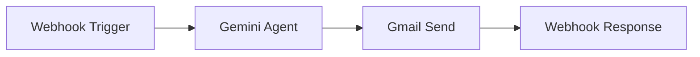

# Quote Email Sender - n8n Workflow Configuration

## Workflow Overview



---

## Step 1: Webhook Node

**Type:** `n8n-nodes-base.webhook`

| Setting | Value |
|---------|-------|
| HTTP Method | POST |
| Path | `quote-email` |
| Response Mode | Last Node |

**Output:** Full payload from the app (quoteId, clientEmail, shareLink, etc.)

---

## Step 2: Gemini Agent Node

**Type:** `@n8n/n8n-nodes-langchain.agent` or custom HTTP Request

**Prompt:**
```
Eres un asistente de ventas. El usuario te proporciona un borrador de correo y contexto de una propuesta comercial.
Tu trabajo es pulir el correo para que sea profesional, persuasivo y conciso.

DATOS DE LA PROPUESTA:
- Cliente: {{$json.clientName}}
- Empresa: {{$json.companyName}}
- Ahorro anual: ${{$json.savingsYear}}
- Link: {{$json.shareLink}}

BORRADOR DEL USUARIO:
{{$json.userDraftBody}}

INSTRUCCIONES:
1. Mejora el texto sin cambiar el sentido
2. Asegúrate de que el link esté incluido
3. Genera un subject atractivo si no hay uno

RESPONDE EN JSON:
{
  "subject": "...",
  "finalBody": "..."
}
```

---

## Step 3: Gmail Node

**Type:** `n8n-nodes-base.gmail`

| Setting | Value |
|---------|-------|
| Resource | Message |
| Operation | Send |
| To | `{{$node["Webhook"].json.clientEmail}}` |
| Subject | `{{$json.subject}}` |
| Email Type | HTML / Text |
| Message | `{{$json.finalBody}}` |

---

## Step 4: Respond to Webhook

**Type:** `n8n-nodes-base.respondToWebhook`

| Setting | Value |
|---------|-------|
| Response Code | 200 |
| Response Body (JSON) | `{ "success": true, "emailId": "{{$node["Gmail"].json.id}}" }` |

---

## Environment Variable

Add to `.env.local`:
```
VITE_N8N_WEBHOOK_URL=https://your-n8n-instance.com/webhook/quote-email
```
